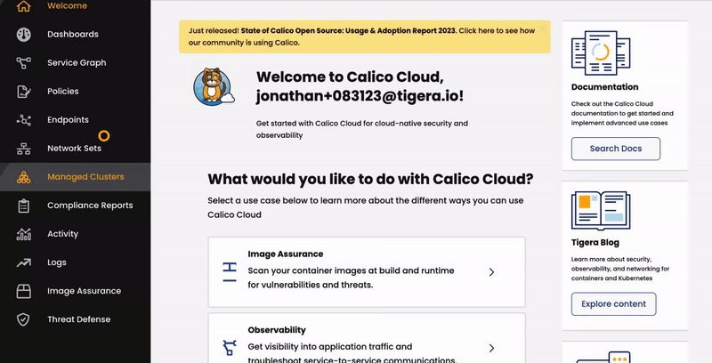

# Enabling Workload-Level Security for AKS with Azure Firewall and Calico Egress Gateway

## Solution Overview

In this repo, we'll develop a foundational reference architecture that aligns with the Azure Well-Architected Framework's [best practices](https://learn.microsoft.com/en-us/azure/architecture/guide/aks/aks-firewall) for network design, with a special emphasis on the [hub-spoke network topology](https://learn.microsoft.com/en-us/azure/cloud-adoption-framework/ready/azure-best-practices/hub-spoke-network-topology). Our goal is to address challenges in pinpointing the source of traffic as it exits the cluster and traverses an external firewall, using [Egress Gateways for Calico](https://docs.tigera.io/calico-enterprise/latest/networking/egress/egress-gateway-azure).


This diagram illustrates our hub-spoke network design and the specific Azure resources used in our reference architecture. Each Spoke VNET shares its Egress Gateway address prefixes with the Azure Route Server located in the Hub VNET, ensuring seamless integration with the Azure network. 


Egress traffic from Kubernetes workloads can be directed through specific Egress Gateways (or none at all), guided by advanced [Egress Gateway Policy](https://docs.tigera.io/calico-enterprise/latest/networking/egress/egress-gateway-azure#configure-a-namespace-or-pod-to-use-an-egress-gateway-egress-gateway-policy-method) settings. This configuration creates a distinct network identity suitable for Azure firewall rule settings.

## Walk Through

We'll use Terraform, an infrastructure-as-code tool, to deploy this reference architecture automatically. We'll walk you through the deployment process and then demonstrate how to utilize Egress Gateways with Calico.

### Prerequisites

First, ensure that you have installed the following tools locally.

1. [azure cli](https://learn.microsoft.com/en-us/cli/azure/install-azure-cli)
2. [kubectl](https://Kubernetes.io/docs/tasks/tools/)
3. [terraform](https://learn.hashicorp.com/tutorials/terraform/install-cli)

### Step 1: Checkout and deploy the Terraform blueprint

Make sure that you completed the prerequisites above and cloned the Terraform blueprint by running the following command in a local directory:

```sh
git clone git@github.com:tigera-solutions/azure-hub-spoke-aks-egress-gateways.git
```

Navigate to the 'azure' subdirectory and then deploy the infrastructure.

If the names `demo-hub-network` and `demo-spoke-networks` are already taken, you will want to edit the [variables.tf](azure/variables.tf) file in Terraform to use custom names for your Hub and Spoke Azure Resource Groups.

```sh
cd azure
terraform init
terraform apply
```

Update your kubeconfig with the AKS cluster credentials

```sh
az aks get-credentials --name spoke1-aks --resource-group demo-spoke-networks --context spoke1-aks
```

Verify that Calico is up and running in your AKS cluster

```sh
kubectl get tigerastatus
```

```sh
NAME        AVAILABLE   PROGRESSING   DEGRADED   SINCE
apiserver   True        False         False      9m30s
calico      True        False         False      9m45s
```

### Step 2: Link your AKS Cluster to Calico Cloud

Join the AKS cluster to Calico Cloud



Verify your AKS cluster is linked to Calico Cloud

```sh
kubectl get tigerastatus
```

```sh
NAME                            AVAILABLE   PROGRESSING   DEGRADED   SINCE
apiserver                       True        False         False      50m
calico                          True        False         False      49m
cloud-core                      True        False         False      50m
compliance                      True        False         False      49m
image-assurance                 True        False         False      49m
intrusion-detection             True        False         False      49m
log-collector                   True        False         False      50m
management-cluster-connection   True        False         False      49m
monitor                         True        False         False      49m
```

### Step 3: Enterprise-grade Egress Gateways for the Azure Kubernetes Service

Connect your AKS cluster to the Azure Route Server. Use the first two nodes in the AKS cluster as BGP route reflectors to manage and limit the number of peer connections effectively. 
```sh
kubectl apply -f - <<EOF
apiVersion: projectcalico.org/v3
kind: BGPConfiguration
metadata:
  name: default
spec:
  logSeverityScreen: Info
  nodeToNodeMeshEnabled: false
  asNumber: 63400
---
kind: BGPPeer
apiVersion: projectcalico.org/v3
metadata:
  name: peer-with-route-reflectors
spec:
  nodeSelector: all()
  peerSelector: route-reflector == 'true'
---
apiVersion: projectcalico.org/v3
kind: BGPPeer
metadata:
  name: azure-route-server-a
spec:
  peerIP: 10.0.1.4
  reachableBy: 10.1.0.1
  asNumber: 65515
  keepOriginalNextHop: true
  nodeSelector: route-reflector == 'true'
---
apiVersion: projectcalico.org/v3
kind: BGPPeer
metadata:
  name: azure-route-server-b
spec:
  peerIP: 10.0.1.5
  reachableBy: 10.1.0.1
  asNumber: 65515
  keepOriginalNextHop: true
  nodeSelector: route-reflector == 'true'
EOF
```

Set up a highly avaiable Calico Egress Gateway for Tenant0. All outgoing traffic from Tenant0 in the AKS cluster will have a static source IP address in the range of `10.99.0.0/29`. This information will be used to configure the Azure Firewall.

```sh
kubectl apply -f - <<EOF
---
apiVersion: v1
kind: Namespace
metadata:
  name: tenant0-egw
---
apiVersion: projectcalico.org/v3
kind: IPPool
metadata:
  name: tenant0-pool
spec:
  cidr: 10.99.0.0/29
  blockSize: 31
  nodeSelector: "!all()"
  vxlanMode: Never
---
apiVersion: operator.tigera.io/v1
kind: EgressGateway
metadata:
  name: tenant0-egw
  namespace: tenant0-egw
spec:
  logSeverity: "Info"
  replicas: 2
  ipPools:
  - name: tenant0-pool
  template:
    metadata:
      labels:
        tenant: tenant0-egw
    spec:
      terminationGracePeriodSeconds: 0
      nodeSelector:
        kubernetes.io/os: linux
      topologySpreadConstraints:
      - maxSkew: 1
        topologyKey: topology.kubernetes.io/zone
        whenUnsatisfiable: DoNotSchedule
        labelSelector:
          matchLabels:
            tenant: tenant0-egw
EOF
```

### Validate the Deployment and Review Results

Validate that the Azure Route Server peers are learning routes from the Azure Kubernetes Services cluster.

```sh
az network routeserver peering list-learned-routes \
  --resource-group demo-hub-network --routeserver hub-rs \
  --name spoke-rs-bgpconnection-peer-1
```

```sh
az network routeserver peering list-learned-routes \
  --resource-group demo-hub-network --routeserver hub-rs \
  --name spoke-rs-bgpconnection-peer-2
```

Each node in the cluster should have a `/26` block from the default pod IP pool and `/31` routes for each Calico Egress Gateway pod.


Turn off BGP advertisement for the default Calico IPPool and validate the default pod IP routes are no longer being learned by the Azure Route Server peers.

```sh
kubectl patch ippool default-ipv4-ippool --type='merge' -p '{"spec":{"disableBGPExport": true}}'
```

In a short while, you should see only the route announcements for the Egress Gateway.

```sh
{
  "RouteServiceRole_IN_0": [
    {
      "asPath": "63400",
      "localAddress": "10.0.1.5",
      "network": "10.99.0.2/31",
      "nextHop": "10.1.0.4",
      "origin": "EBgp",
      "sourcePeer": "10.1.0.4",
      "weight": 32768
    }
  ],
  "RouteServiceRole_IN_1": [
    {
      "asPath": "63400",
      "localAddress": "10.0.1.4",
      "network": "10.99.0.2/31",
      "nextHop": "10.1.0.4",
      "origin": "EBgp",
      "sourcePeer": "10.1.0.4",
      "weight": 32768
    }
  ]
}
```

You can also manage the number of route announcements for Egress Gateway CIDRs by using Calico BGP Filters. The following BGPFilter allows the routing advertisements for our egress gateways. 

```sh
kubectl apply -f - <<EOF
kind: BGPFilter
apiVersion: projectcalico.org/v3
metadata:
  name: export-egress-ips
spec:
  exportV4:
    - action: Reject
      matchOperator: NotIn
      cidr: 10.99.0.0/29
EOF
```

Deploy a `netshoot` pod into the default namespace.

```
kubectl apply -f manifests/netshoot.yaml
```

Test to see if you can make an outbound http request to the `www.tigera.io` website.  These should fail with a message from the firewall letting you know the requests are not allowed by any existing firewall rules.

```
kubectl exec -it -n default netshoot -- curl -v https://www.tigera.io
```

You should see a message similar to the following.

```
*   Trying 178.128.166.225:80...
* Connected to www.tigera.io (178.128.166.225) port 80 (#0)
> GET / HTTP/1.1
> Host: www.tigera.io
> User-Agent: curl/8.0.1
> Accept: */*
>
< HTTP/1.1 470 status code 470
< Date: Sun, 03 Sep 2023 12:27:41 GMT
< Content-Length: 70
< Content-Type: text/plain; charset=utf-8
<
* Connection #0 to host www.tigera.io left intact
Action: Deny. Reason: No rule matched. Proceeding with default action.
```

Now let's enable Calico Egress Gateways and using 

```
kubectl patch felixconfiguration default \
  --type='merge' -p '{"spec":{"egressIPSupport":"EnabledPerNamespaceOrPerPod"}}'
```

Using Source based 

```
kubectl annotate ns default \
  egress.projectcalico.org/namespaceSelector="projectcalico.org/name == 'tenant0-egw'"
```

```
kubectl exec -it -n default netshoot -- curl -IL https://www.tigera.io
```

```sh
kubectl apply -f - <<EOF
apiVersion: projectcalico.org/v3
kind: EgressGatewayPolicy
metadata:
  name: "egw-policy"
spec:
  rules:
  - destination:
      cidr: 10.0.0.0/8
    description: "Local: no gateway"
  - destination:
      cidr: 10.99.0.0/29
    description: "Tenant0 Egress Gateway"
    gateway:
      namespaceSelector: "projectcalico.org/name == 'default'"
      selector: "k8s-app == 'tenant0-egw'"
EOF
```

### Cleanup
